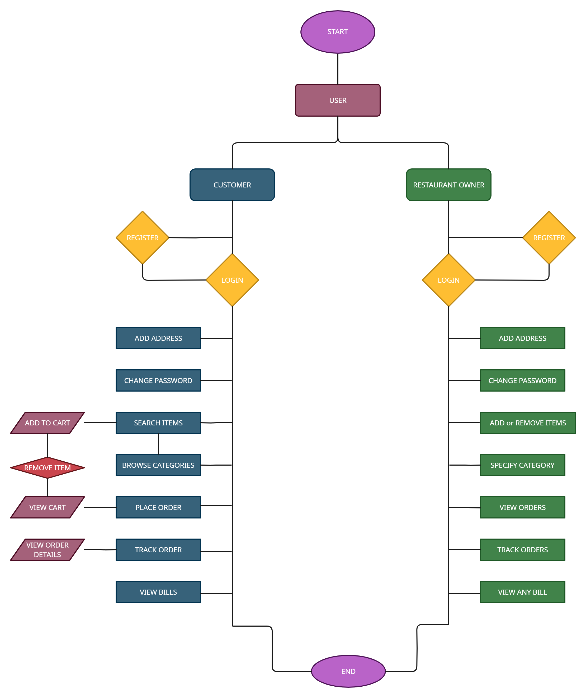

# Your Door Food

    
<!--      -->

  

# Your Door Food

 **REST API SERVICE**

The **Your Door Food** is a REST API, which allows **Customers** to browse the food, **Save** them to **Cart** for the future, perform all the basic fundamental **CRUD** operations like any other **Online Food Ordering and Delivery Application** and place orders as per their requirements. It is also allow **Restaurant** to **Add the food**, and can manage **Cost** and **Quantity**.

The **Your Door Food** API also provides **User, Admin Validation & Authentication** for every operation and simplified Exception Handling for layman's easy understanding. 

The API's primary objective is to provide to the Customer  **a Simple & User-Friendly online food ordering Experience.**

The API's Services  will be used by the **Three** categories of users:

- **Admin (Administrator)**

- **User (Customer)** 

- **User (Restaurant)** 
## Tech Stack

- JAVA
- SPRING
- SPRINGBOOT
- HIBERNATE
- MAVEN
- J.D.B.C
- MYSQL
<!-- - SWAGGER UI -->

## Dependencies

- SPRING DATA JPA
- SPRING BOOT DEVTOOLS
- SPRING WEB
- HIBERNATE
- MYSQL DRIVER
- VALIDATION
- LOMBOK
<!-- - SWAGGER UI -->

## Modules

- Restaurant Module
- Customer Module
- Admin Module
- Food Module
- Cart Module 
- Order Module
- Bill Module
- Exception Handler Module

## System Structure

The REST API allows a Customer to **Signup, Login** & **Browse** through the food, view products as well as the Restaurant and add food to **Cart** wishlist, as well as for the Restaurant to **View** all the **Orders, Customers & food**.

Restaurants can **Add, Update, View, and Delete** **Food**  from the **Database**.

Administrator can **View request Delete Account List** and **Delete the Account As Per Request**.

<!-- ## About
This project is a team project of 4 members, This is an online ordering and delivery Rest API. We built this Rest API project Within 5 days and this is our project during **the Masai curriculum (Construct Week)** [Demo Video](https://drive.google.com/file/d/1URK-TPSboVi9UFAYG8AROuHEMNi-4vzr/view).-->

## Feature
- Restaurant
    - 
    - Signup
    - Login & Logout
    - View all Food
    - View all Orders of an Customer as order that Restaurant
    - Add New Food into Database
    - Remove Food from Database
    - Update Food in Database 
    - Update their Profile

- Customer
    -
    - Signup 
    - Login & Logout
    - Update all Personal Details 
    - View all Food .
    - Add Food to Cart
    - Update Food Quantity in Cart 
    - Delete Food from Cart
    - Empty Cart
    - Add Order
    - Cancel Order
    - View Orders

- Administrator
    -
    - Login
    - View Deleted Account Request
    - Delete Account as per Request

## Installation

<!--- copy this https://github.com/sunnylalwani41/Your_Door_Food_REST_API.git -->
- Select the path where you want to store the project on your pc
- open the corresponding file/folder with the editor
- open the terminal of your editor
- use  --> git clone (paste link) <-- 
- after the project is cloned to your folder
- go to the YourDoorFoodApplication.java file inside com folder
- run as Spring Boot

# FLOW CHART

<!--  -->

# Entity Relationship Diagram

